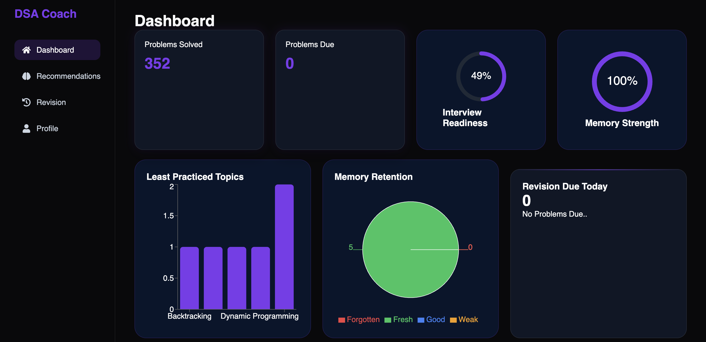
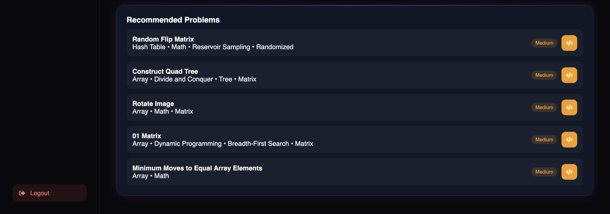
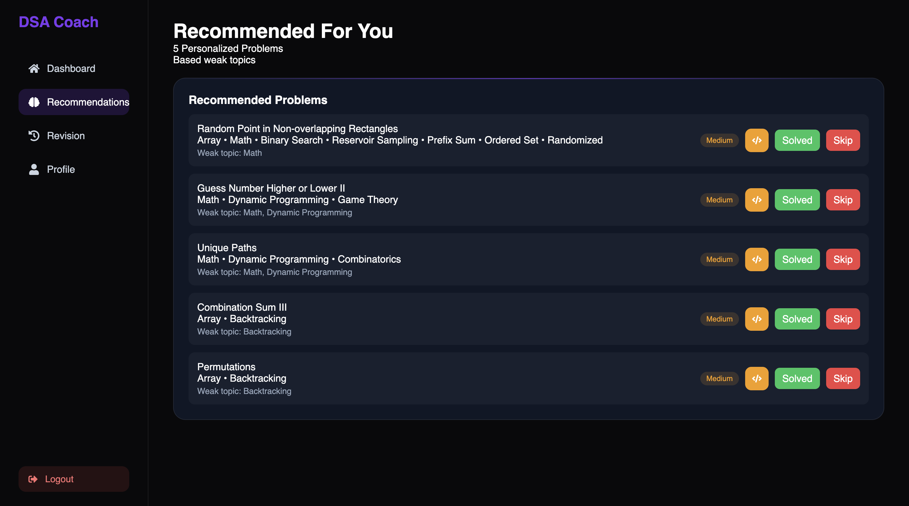
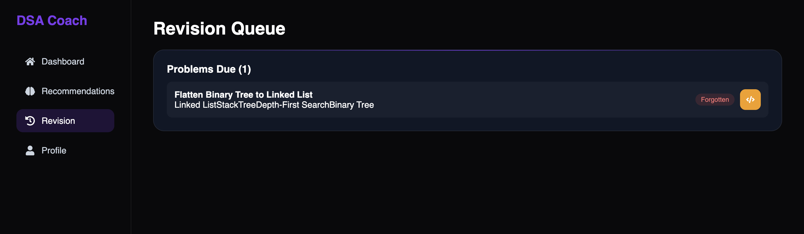
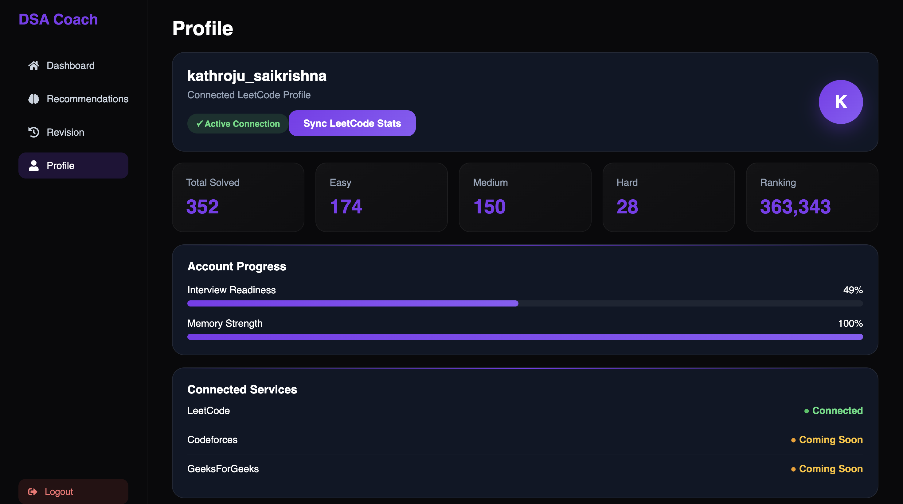

# 🚀 DSA Coach 2.0


## 🌐 Live Demo

**Frontend:** https://dsa-coach-2-0.vercel.app

---

# Overview

DSA Coach 2.0 is a full-stack MERN application that helps developers prepare for coding interviews using personalized learning.

The platform analyzes a user's LeetCode profile, identifies weak topics, recommends relevant problems, tracks memory retention, measures interview readiness, and provides resume analysis.

To improve performance and scalability, Redis caching is integrated to reduce repeated database queries and unnecessary LeetCode API requests.

---

# Features

## Authentication

- User Registration & Login
- JWT Authentication
- Protected Routes

---

## LeetCode Integration

- Connect LeetCode Profile
- Fetch Live LeetCode Statistics
- Sync Progress Anytime
- Store User Progress

---

## Smart Recommendation Engine

- Personalized Problem Recommendations
- Difficulty-Based Recommendations
- Weak Topic Detection
- Recommendation History
- Mark Problems as Solved
- Skip Recommendations

---

## Memory Retention System

- Forgotten Problem Detection
- Revision Queue
- Memory Strength Score
- Retention Classification
- Revision Priority

---

## Analytics Dashboard

- Interview Readiness Score
- Memory Strength Score
- Weak Topics Analysis
- Progress Tracking
- LeetCode Statistics Visualization

---

## Resume Analyzer

- Resume Upload
- AI-powered Resume Analysis
- ATS-style Feedback
- Skill Gap Suggestions

---

# ⚡ Performance Optimizations

Implemented Redis caching using the **Cache-Aside Pattern** to improve API performance.

Cached APIs include:

- LeetCode Statistics
- Recommendation Engine
- Memory Analytics
- Interview Readiness
- Weak Topics Analysis

Additional Optimizations

- Redis Cache Invalidation
- Reduced MongoDB Queries
- Reduced External LeetCode API Calls
- TTL-based Cache Expiration

---

# 🏗 Architecture

```
                     React (Vercel)
                            │
                            │
                       REST APIs
                            │
                            ▼
                 Express.js Backend (Render)
                            │
          ┌─────────────────┼──────────────────┐
          │                 │                  │
          ▼                 ▼                  ▼
    MongoDB Atlas      Redis Cache      LeetCode GraphQL
          │
          ▼
 Recommendation Engine
 Memory Analytics
 Readiness Scoring
 Resume Analysis
```

---

# Tech Stack

## Frontend

- React.js
- React Router
- Axios
- Recharts
- React Hot Toast
- CSS3

---

## Backend

- Node.js
- Express.js
- MongoDB
- Mongoose
- Redis
- JWT Authentication
- Axios

---

## Deployment

- Vercel
- Render
- MongoDB Atlas
- Redis Cloud

---

# Key Engineering Highlights

- Personalized Recommendation Engine
- Weak Topic Detection
- Memory Retention Analytics
- Interview Readiness Prediction
- Redis-based API Caching
- Cache Invalidation Strategy
- RESTful API Design
- Modular Backend Architecture
- MongoDB Aggregation Pipelines

---

# 📂 Project Structure

```
frontend/
    components/
    pages/
    context/
    charts/

backend/
    controllers/
    routes/
    middleware/
    models/
    config/
```

---

# 📸 Screenshots

## Dashboard





---

## Recommendations



---

## Revision Queue



---

## Profile



---

# 🔌 API Endpoints

## Authentication

```
POST /api/auth/register
POST /api/auth/login
```

## Profile

```
GET /api/profile
PUT /api/profile
```

## LeetCode

```
GET /api/leetcode
```

## Recommendations

```
GET /api/recommendations
POST /api/recommendations/:id/solve
POST /api/recommendations/:id/skip
```

## Analytics

```
GET /api/recommendations/memory
GET /api/recommendations/readiness
GET /api/recommendations/weaktopics
GET /api/recommendations/history
GET /api/recommendations/revision
```

---

# ⚙ Installation

## Clone Repository

```bash
git clone https://github.com/kathrojusaikrishna/dsa-coach-2.0.git

cd dsa-coach-2.0
```

---

## Backend

```bash
cd backend

npm install

npm run dev
```

---

## Frontend

```bash
cd frontend

npm install

npm run dev
```

---

# 🔑 Environment Variables

## Backend (.env)

```env
MONGO_URI=

JWT_SECRET=

REDIS_HOST=

REDIS_PORT=

REDIS_USERNAME=

REDIS_PASSWORD=
```

---

## Frontend (.env)

```env
VITE_API_URL=
```

---

# Motivation

Preparing for coding interviews usually involves solving random problems without tracking strengths and weaknesses.

DSA Coach 2.0 aims to provide a personalized preparation experience by analyzing LeetCode progress, identifying weak concepts, recommending targeted problems, measuring memory retention, and estimating interview readiness.

---

# 🚀 Future Improvements

- Codeforces Integration
- GeeksforGeeks Integration
- Contest Tracking
- Spaced-Repetition Scheduler
- AI-powered Recommendation Engine
- Email Reminders
- Daily Challenge Notifications

---

# Author

**Saikrishna Kathroju**

GitHub: https://github.com/kathrojusaikrishna

LinkedIn: https://www.linkedin.com/in/kathroju-saikrishna/

---

# If you found this project interesting, consider giving it a star!
